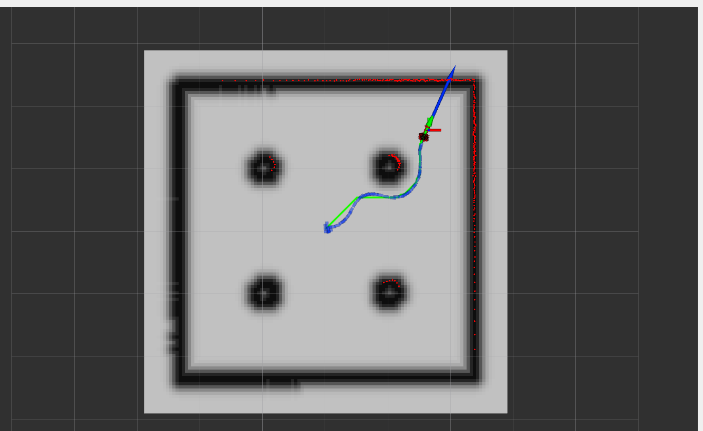
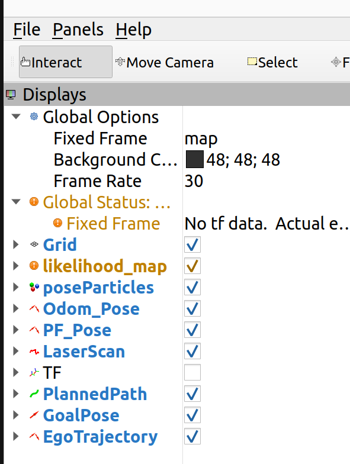

# LAB 4 - Path planning and navigation

## Introduction

Welcome to LAB 4 of the mobile robotics course! 
In this lab, participants will gain experience with implementing a path planner and drive the robot using the obtained plan.
By the end of this lab, participants will be able to:
- Use a map to create a graph for graph-based path planner;
- Generate a plan with the path planner and navigate the robot through the path to specified goals.

*Part 1* and *Part 2* are the same as in the previous labs they are here just for your convenience.


#### The summary of what you should learn is as following:
You will learn how to:
- Create a cost map from a pre-aquired map;
- Generate an optimal path using the A* algorithm;
- Execute a path on a mobile robot.

**NOTE** this Lab builds on top of Lab 2 and Lab 3. A complete solution to Lab 2 and Lab 3 is provided within this lab so that even if you did not conclude Lab 2 and Lab 3's implementation, you can still work on Lab 4 without penalties. You are welcome to replace some of the code with your own development from Lab 2 and Lab 3.

Check ```rubrics.md``` for the grading scheme of this lab.

### NOTES for pre-lab activities
Given the limited time in the lab, it is highly recommended to go through this manual and start (or complete) your implementation before the lab date, by working on your personal setup (VMWare, remote desktop, lent laptop), and using simulation for testing when needed to verify that your codes are working before coming into the lab. For simulation, refer to [tbt3Simulation.md](https://github.com/UW-MTE544/MTE544_student/blob/main/tbt3Simulation.md) in the `main` branch.

During the 3 hours in the lab, you want to utilize this time to test your code, work with the actual robot, get feedback from the TAs, and acquire the in-lab marks (check `rubrics.md` in the same branch).

While in-lab, you are required to use the Desktop PCs and **NOT** your personal setup (VMWare, remote desktop, lent laptop). So, make sure that you have your modified files, either online or on a USB, with you to try it out in-lab. 

#### For Simulation
To test your code in simulation, you need a simulation environment where there are obstacles, I have provided a scanned map in the `your_map` folder, and it corresponds to
```
ros2 launch turtlebot3_gazebo turtlebot3_dqn_stage2.launch.py
```

You are also welcome to use some other map, or even add obstacles by yourself in gazebo, just remember to use the same map for SLAM and the particle filter and the A star path planner.

### Pre-lab deliverable (5 marks)
A first version of the completed code is to be submitted **24 hours before the group's lab section** (e.g. groups on the Thursday section must submit by Wednesday at 5:30 PM), along with a list of doubts/questions to be solved during the in-person lab section (optional, if needed). The in-person lab is not meant for implementation but for testing and getting help from the TAs. 

Failure to submit will result in a penalty of 5 marks on the lab report. The code does not have to be fully correct, but it should be (at least almost) complete and meaningful with appropriate comments.


## Part 1 - connecting to the robot (no marks)
Open the [connectToUWtb4s.md](https://github.com/UW-MTE544/MTE544_student/blob/main/connectToUWtb4s.md) markdown file in the main branch, and follow along. Read and follow each step carefully.

## Part 2 - Robot teleop (no marks)

In this part, you will learn to play with the robot; you will get to undock it from the charger and then move it around by keyboard.  
When you want to dock it again, It should be able to find it only when it is in less than ~0.5 meter around it. Note, that it doesn't
necessarily goes to the dock that it was undocked from, it will just find the next available dock.

The undock command goes through a [action server](https://docs.ros.org/en/humble/Tutorials/Intermediate/Writing-an-Action-Server-Client/Cpp.html).

```
ros2 action send_goal /undock irobot_create_msgs/action/Undock {}
```
You robot should undock.
If not, revisit *Part 1* - Connect to robot via VPN, and make sure the VPN terminal is still running and that you can still see the robot's topics. If you suspect the vpn isn't working, make sure you terminate it, and then run again.

Next run the teleop command to be able to move the robot manually around.

```
ros2 run teleop_twist_keyboard teleop_twist_keyboard
```

See the prompt for help on the keys. 

To dock the robot, use:

```
ros2 action send_goal /dock irobot_create_msgs/action/Dock {}
```

### NOTE: when you open a new terminal, you need to source again and set the domain ID, or you will not see the topics:

- Source the .bashrc file: `source ~/robohub/turtlebot4/configs/.bashrc`
- Declare ros2 domain: `export ROS_DOMAIN_ID=X` (X being the number of your robot)

### Odometry reset
For this lab, you may want to reset the odometry so that when you start your path, the odometry starts from the (0, 0, 0) state.
Use this command to reset the odometry on the physical TurtleBot4 (in **simulation**, by simply **restarting** the simulation, you can reset the odometry):

```
ros2 service call /reset_pose irobot_create_msgs/srv/ResetPose {}

```

## Part 3 - Map aquisition (5 marks)

We are planning to have one map, you will scan it and save it as `room` map. Remember to use the same map for the particle filter and the A star path planner.

#### Put your scanned map in the `your_map` folder and name it `room.pgm` and `room.yaml`.

Undock the robot, put the robot in the entrance marked for you, **try your best to align the robot with the marker**, and reset the odometry, and then acquire the map as you did in LAB-1 and save it as room for use in the planning.

```
# terminal 1: reset the odometry pose
ros2 service call /reset_pose irobot_create_msgs/srv/ResetPose {}
# terminal 2: run the SLAM
ros2 launch turtlebot4_navigation slam.launch.py
# terminal 3: view the results in RViz
ros2 launch turtlebot4_viz view_robot.launch.py
# terminal 4: move around the robot
ros2 run teleop_twist_keyboard teleop_twist_keyboard
# terminal 5: save the map
ros2 run nav2_map_server map_saver_cli -f room
``` 

**Note: if you face "Failed to spin map subscription" error, just rerun the `ros2 run nav2_map_server map_saver_cli -f room`**.

When the map is **acquired and saved**, make sure you **take out the robot from the map** and **leave room for the other groups**.

#### In-lab marking: Show the map to a TA to score the marks associated to this part.


## Part 4 - Complete the A* algorithm (25 marks)
A mostly-completed A* algorithm is provided in ```a_star.py```.

For this part:
- Follow the comments to complete the code in ```a_star.py``` to plan the path using the A* algorithm. 
- Implement two different heuristics: Manhattan distance and Euclidean distance. A policy for switching between these two heuristics is not implemented, you are free to implement this the way you prefer (hard coded or with switching parameter or any other way).


## Part 5 - Complete the code for testing the path (15 marks)
To utilize the planner, it is necessary to create a cost map and define a goal pose. Differently from previous planners you have used, in this case the searching algorithm will create a list of poses that the robot has to follow (a path). So some adaptations to the code are necessary.

For this part:
- Complete the code in ```planner.py``` to create the cost map using the ```mapManipulator``` from ```mapUtilities.py```;
- Complete the code in ```planner.py``` to create a trajectory that is a list of goal poses returned by the searching algorithm which correspond to the path to follow;
- Complete the code in ```decisions.py``` to adapt the code for the path planner.


## Part 6 - Test your path planner (10 marks)
To test the path planner:
- Choose at least two different goal poses (can be consecutive goal points during the same execution) on your map that are significantly far from each other and perform path planning and navigation for each ot these two goals.
- Perform the planning for each of these two goal poses with the two heuristics implemented in Part 4 (Manhattan and Euclidean).
- Run the following commands, as we are using the particle filter for localization, you **don't have to align the robot with the marker**, you **don't have to reset the odometry**, just place the robot in the map, and give a good guess for the robot pose in Rviz:
  ```
  # terminal 1
  python3 particleFilter.py
  # terminal 2
  rviz2 -d for_pf.rviz
  # terminal 3
  python3 decisions.py
  ``` 
  - When the Rviz window opened throw a good guess by using ```2D Pose Estimate``` button in the top toolbar.
  - When the particles converged, choose your goal using ```2D Goal Pose``` button in the top toolbar.

Remember to **save the robotPose.csv file for the report and take a screenshot of the pop up window with the A star path and the RVIZ after the robot reach the goal**.

An example planned path is shown below:


An example of the robot reaching the goal is shown below (where the pose from particle filter is shown in blue arrow, the green arrow is from raw sensor, and the axis indicates the goal, green path shows the planned path, and the blue path shows the executed path):


You need to **clear the executed path** via uncheck and check the `EgoTrajectory` in the `Displays` panel in RViz **BEFORE you plan the next path via the `2D Goal Pose` button**.


#### In-lab marking: Show the path execution with at least two goal poses and one heuristic to a TA to score 10 marks. Show the TA where are your goal poses within the map on RViz and what is the used heuristics.


## Part 7 - Experiments for the report (10 marks)
Redo the Part 6 with the **other heuristic** and **save the robotPose.csv file for the report and take a screenshot of the pop up window with the A star path and the RVIZ after the robot reach the goal**.

#### In-lab marking: Show the path execution with at least two goal poses and one heuristic to a TA to score 10 marks. Show the TA where are your goal poses within the map on RViz and what is the used heuristics.


## Conclusions - Written report (30 marks)
You can do this part in the lab (time allowing) or at home. **Make sure you have the proper data saved**.

Please prepare a written report containing on the front page:
- Names (Family Name, First Name) of all group members;
- Student ID of all group members;
- Station number and robot number.

In a maximum of 3 pages (excluding the front page), report the performance of the path planner. This report should contain the following:

* Describe how you implemented the path planning and navigation for the robot from the planner to the actual motions of the robot, including how the provided code works.
* Figures illustrating the map, with the trajectories generated for the two goal points overlayed on the map. Make sure to clearly mark the starting and ending locations of the robot. (You can also use the saved screenshots from RVIZ if you don't want to spend time on this).
* Compare the two different heuristics (Manhattan and Euclidean distances, they can be on the same plot, but use different colors). Discuss the results. Are they different, if yes, why, if not why. Which one is better, and why?

## Submission

Submit the report and the code on Dropbox (LEARN) in the corresponding folder. Only one submission per group is needed:
- **Report**: one single pdf;
- **Code**: make sure to have commented your code! Submit one single zip file with everything (including the csv files obtained from the data log and the map files).


Good luck!
